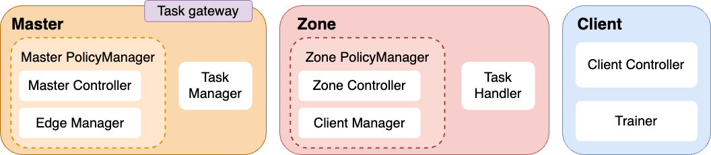

## Daisy Nodes
Daisy provides three kinds of nodes to build FL topologies. They are Master, Zone and Client. Please refer to the following image:

We can use these nodes to build our FL topologies in [02_topology](02_topology.md)
