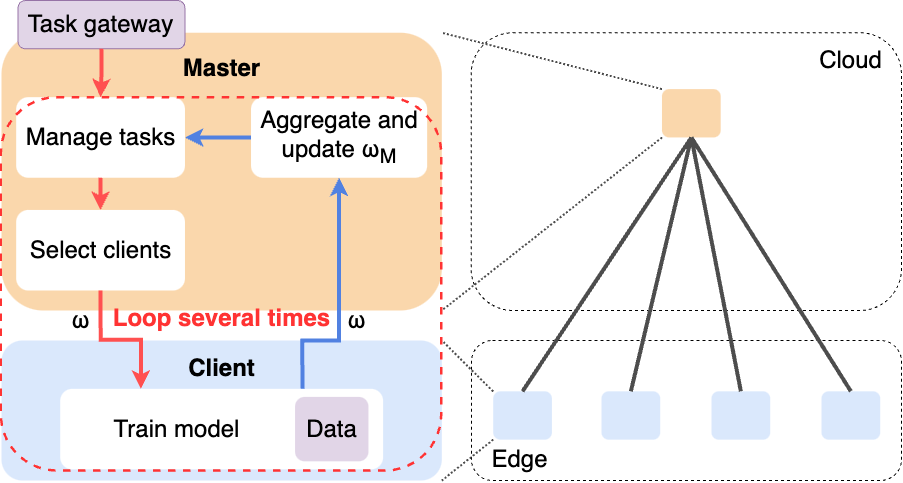
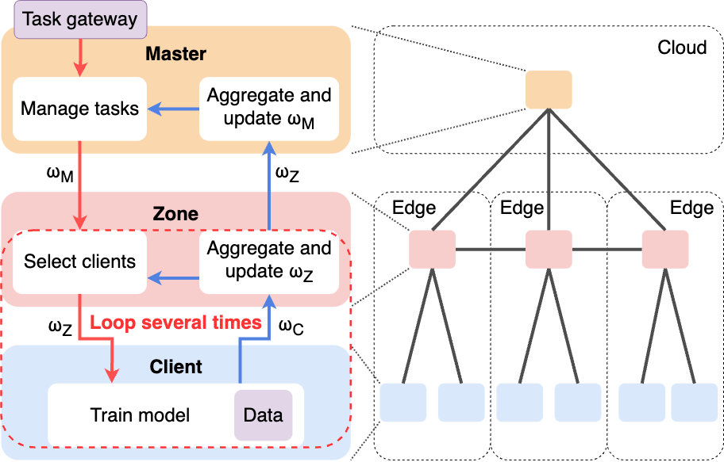
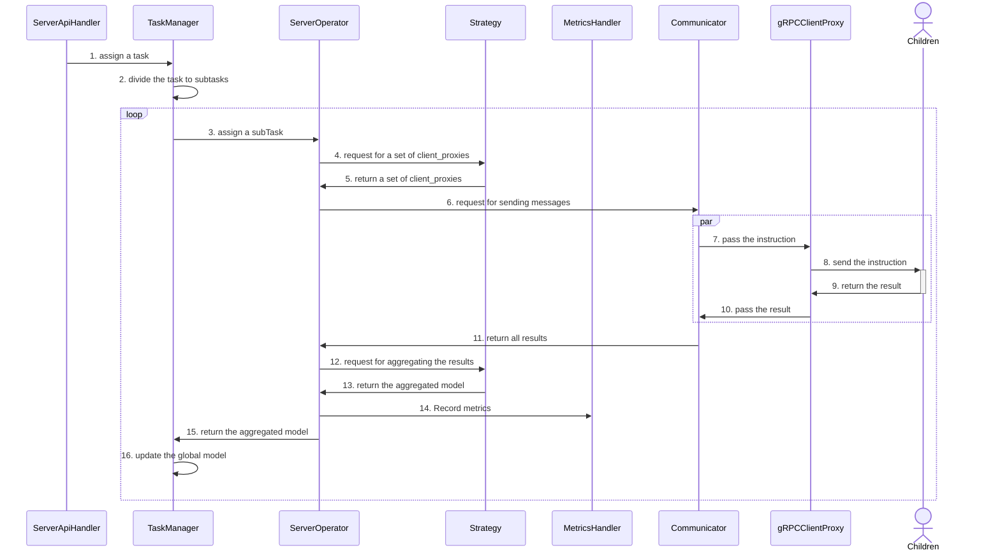
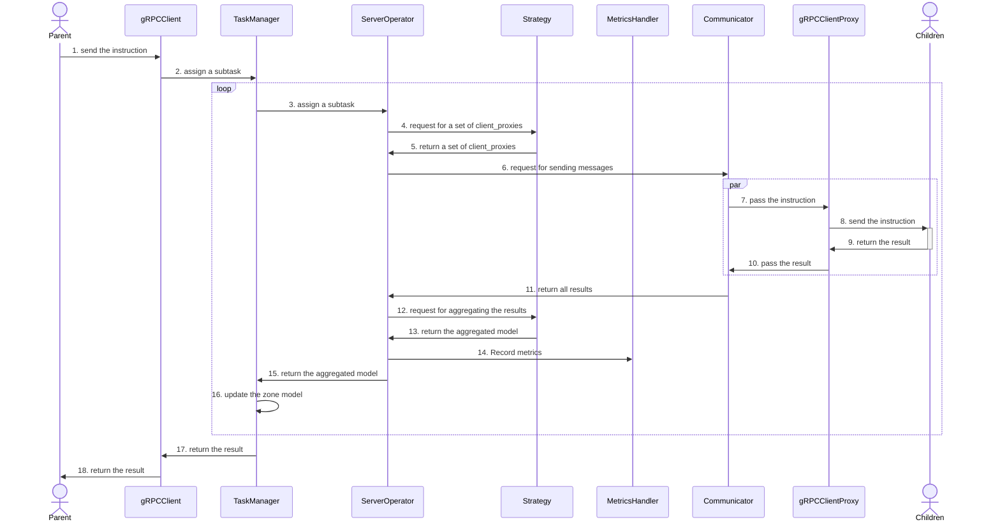
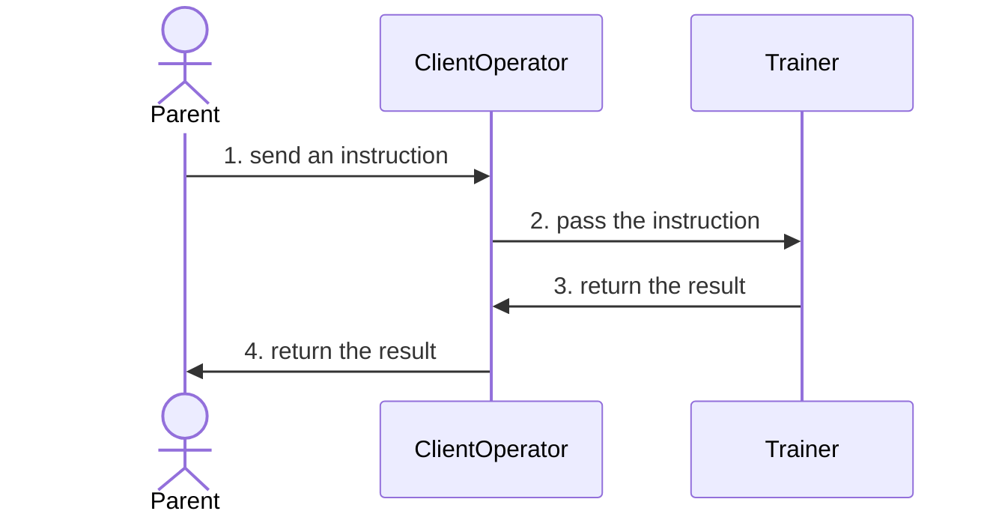

## FL Topologies in Daisy
We can declare a traditional (hub-and-spoke) FL topology like

that we directly connect Client nodes to the Master node. Moreover, Daisy supports for hierarchical FL like

For the details, the operational flows in these nodes are like

### Master

### Zone

### Client

