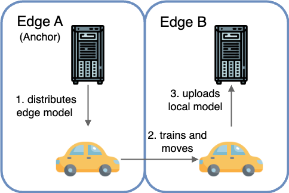
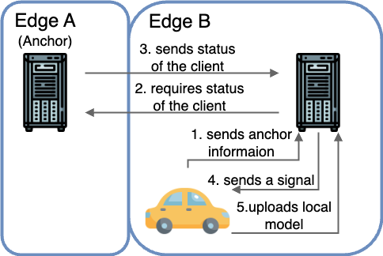

## Roaming and Proximal Transmission

In some cases of EdgeAI, FL clients have mobility and may move across from an edge to another. It is like

To save the communication cost in these cases, we introduced "Proximcal Transmission" to Daisy, which means we can upload local models to the proximal edge server instead of the anchor.

